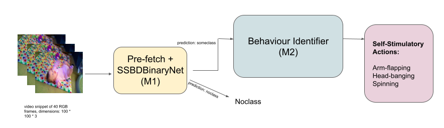

# SSBD+
Code and material relevant to the paper, "Introducing SSBD+ Dataset with an Attentive Convolutional Pipeline for detecting Self-Stimulatory Behaviours in Children using raw videos"  

--- 
All relevant links can be found here:
###  Installation and Usage: [INSTALL.md](./docs/INSTALL.md)
###  Models and their description: [MODELS.md](./docs/MODELS.md) 