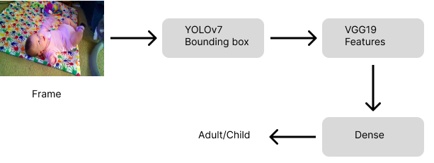
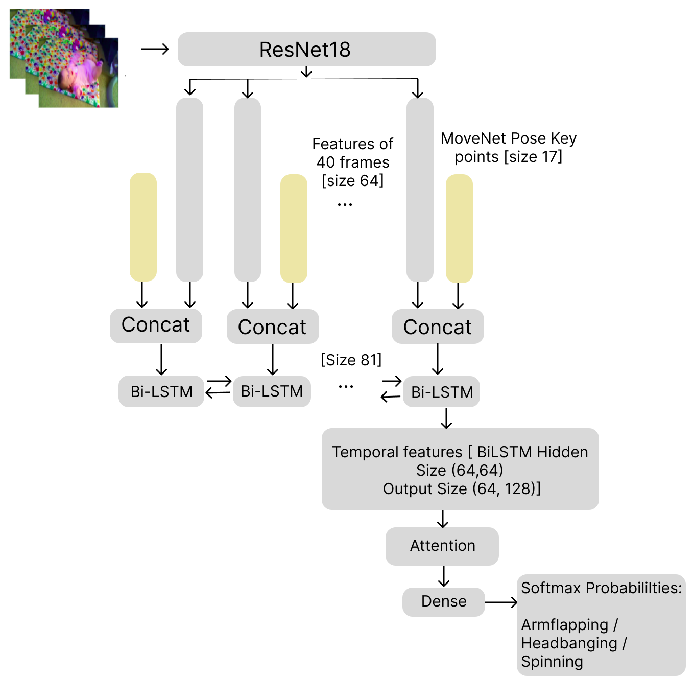

## SSBDPLUS - Models

### M1 - Preprocessing: Prefetch

Code and documentation for this model can be found [here](../src/ssbdplus/prefetch.py)

### M1 - Action presence detection
  

Code and documentation for this model can be found [here](../src/ssbdplus/m1.py)

### M2 - Action type classification

Code and documentation for this model can be found [here](../src/ssbdplus/m2.py)

## Running the pipeline

To use the model used in the paper for your task, you can initialise an object defined in the [pipeline file](../src/ssbdplus/pipeline.py)